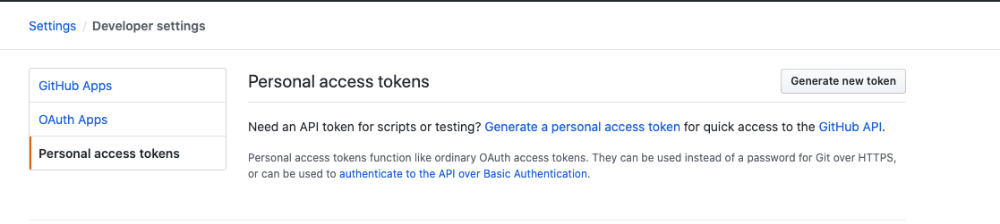
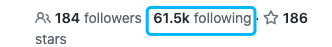
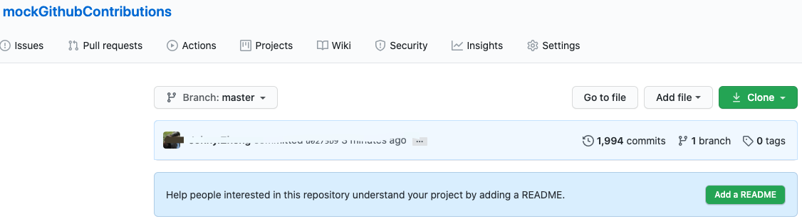
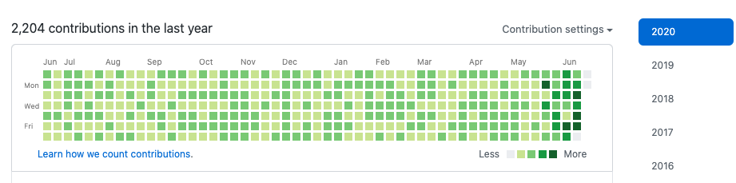

# GithubOperator
La herramienta es 😈 arriesgada, ¡Por favor use con precaución.👀

##  Automaticamente seguir cuentas de usuarios de github

1. Primero encuentre una cuenta de github con más seguidores y obtén su id

    

2. Obtén un token de acceso personal

    

    ```
    Click generate new token
    ```
   
3. Actualiza config.ini
    ```
    [default]
    email = correo electrónico de github
    user = nickname de github
    password = contraseña de github
    accessToken = accessToken de github
    baseUrl = https://github.com/
    apiUrl = https://api.github.com
   
    [follower]
    sourceUser = nickname con más seguidores
    exceeded = True 
    totalPage = 2000
    exceeded = True # por defecto. para resolver el límite de github
    retryDetailFile = retry_detail_file.txt
    retryCount = 10 # Si tu red no es buena, este parámetro puede ser aumentado
    randomUser = False
    startPage = 2
    group = 100
    ```

4. Clona y ejecuta
    ```
    git clone https://github.com/zsjohny/GithubOperator.git && cd GithubOperator && ./AutoAddFollower.py
    ```
   
5. Si falla el trabajo
    Si encuentras que put_retry_detail_file.txt y retry_detail_file.txt no 
    están vacíos, necesitas ejecutar `./AutoAddFollower.py` de nuevo.
    
6. Usar usuario aleatorio `Actualiza config.ini`
    ```
    randomUser = False
    ```
   
7. Actualiza el nivel de registro `config.py`
    ```
    logging.basicConfig(level=logging.WARNING)
    ```
    
8. Resultado
    
    
    

## Automáticamente Mock de Contribuciones de Github

1. Actualiza Email

    La dirección de correo electrónico utilizada para los commits está asociada con tu cuenta de GitHub.

    [Aprende cómo contamos contribuciones.](https://help.github.com/en/github/setting-up-and-managing-your-github-profile/why-are-my-contributions-not-showing-up-on-my-profile)
   
2. Actualiza config.ini
    ```
    [default]
    email = correo electrónico de github
    user = nickname de github
    password = contraseña de github
    accessToken = accessToken de github  [innecesario]
    baseUrl = https://github.com/
    apiUrl = https://api.github.com
   
    [contributions]
    repoName = mockGithubContributions
    ```
   
3.  Clona y ejecuta
    ```
    git clone https://github.com/zsjohny/GithubOperator.git && 
    cd GithubOperator && ./mockGithubContributions.py 365
    ```
    
4. Resultado
    
    
    
    
    
</arg_value></tool_call>
