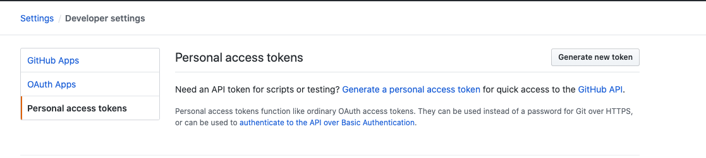

# GithubOperator

# Automatically follow github user accounts
1. First find a github account with more followers and get his id
    

2. Get personal access token

    

    ```
    Click generate new token
    ```
   
3. Update config.ini
    ```
    [default]
    email = github email
    user = github nickname
    password = github password
    accessToken = github accessToken
    sourceUser = Most followers someone nickname
    exceeded = True 
    baseUrl = https://github.com/
    apiUrl = https://api.github.com
    ```

4. Clone
    ```
    git clone  && cd GithubOperator && ./AutoAddFollower.py
    ```
