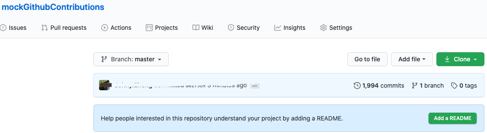
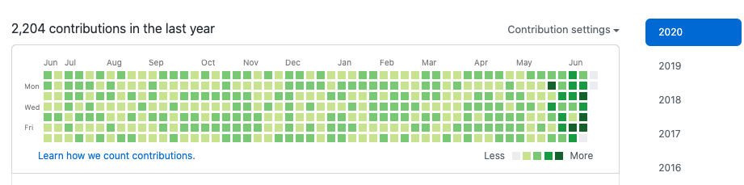

# GithubOperator

##  Automatically follow github user accounts

1. First find a github account with more followers and get his id

    

2. Get personal access token

    

    ```
    Click generate new token
    ```
   
3. Update config.ini
    ```
    [default]
    email = github email
    user = github nickname
    password = github password
    accessToken = github accessToken
    baseUrl = https://github.com/
    apiUrl = https://api.github.com
   
    [follower]
    sourceUser = Most followers someone nickname
    exceeded = True 
    totalPage = 2000
    exceeded = True # default. to solve limit of github
    retryDetailFile = retry_detail_file.txt
    retryCount = 10 # If your network is not good, this parameter can be increased
    randomUser = False
    startPage = 2
    group = 100
    ```

4. Clone and Run
    ```
    git clone https://github.com/zsjohny/GithubOperator.git && cd GithubOperator && ./AutoAddFollower.py
    ```
   
5. Run fail job
    If you found put_retry_detail_file.txt and retry_detail_file.txt not 
    empty, you need `./AutoAddFollower.py` again.
    
6. User random user `Update config.ini`
    ```
    randomUser = False
    ```
   
7. Update log level `config.py`
    ```
    logging.basicConfig(level=logging.WARNING)
    ```
    
8. Result
    
    
    


## Automatically Mock Github Contributions

1. Update Email

    The email address used for the commits is associated with your GitHub account.

    [Learn how we count contributions.](https://help.github.com/en/github/setting-up-and-managing-your-github-profile/why-are-my-contributions-not-showing-up-on-my-profile)
   
2. Update config.ini
    ```
    [default]
    email = github email
    user = github nickname
    password = github password
    accessToken = github accessToken  [unnecessary]
    baseUrl = https://github.com/
    apiUrl = https://api.github.com
   
    [contributions]
    repoName = mockGithubContributions
    ```
   
3.  Clone and Run
    ```
    git clone https://github.com/zsjohny/GithubOperator.git && 
    cd GithubOperator && ./mockGithubContributions.py 365
    ```
    
4. Result
    
    
    
    
    
